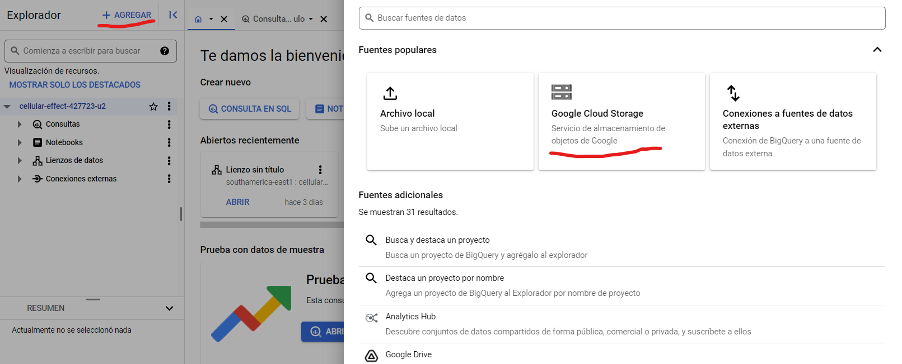

# Data Wherehouse en GCP

## 1 - Crear un Bucket en GCP

En Google Cloud Platform (GCP), un bucket es un contenedor fundamental de almacenamiento de objetos. Es similar a una carpeta en tu computadora, pero en lugar de almacenar archivos localmente, los objetos (que pueden ser archivos, imágenes, videos, etc.) se almacenan en la nube de Google.

Para hacerlo, primeramente debemos crear un nuevo proyecto en el cual trabajar o en caso contrario seleccionar el que deseamos:


Luego, seleccionamos en el menú desplegable de la izquierda la opción Cloud Storage, y luego Buckets:


Nos daremos cuenta que no tendremos ningún Bocket (1) y por ende vamos a crear uno (2):


Luego de crearlo debemos colocar un nombre, que será único en toda la plataforma y damos siguiente sin agregar etiquetas. 

En tipo de ubicación dejamos en EEUU y continuar.

La clase de almacenamientoi la dejamos en la configuración estándar y continuamos.

En acceso a los objetos dejamos en estándar impidiendo que quede abierto al público y le damos en crear. Si aparece un aviso de que está sin acceso público es que nos ha creado correctamente el Bocket.

De esta manera deberíamos ver la interfaz de Buckets:


Ahora, para cargar los datos desde nuestra PC debemos usar un script de Python que cargue los datos a través de una llave de acceso que se mostrará ahora como crear.

### Creación de la Llave de Acceso 

Vamos a la barra lateral izquierda nuevamente y seleccionamos IAM y Administración, luego cuentas de servicio:


Ahora le damos en CREAR CUENTA DE SERVICIO:


Cargamos los detalles de la cuenta de servicio:


En rol seleccionamos Básco y luego Propietario. Damos continuar:


La última opción la dejamos en blanco y damos LISTO.

En el menú desplegable de la derecha del Permiso seleccionamos Administrar Claves:


En la pestaña AGREGAR CLAVE le damos en Crear clave Nueva, en el cuadro de diálogo nos pedirá el formato, seleccionamos JSON. Luego lo nombramos y descargamos en un lugar seguro, ya que con ella cualquier persona podría hacer cambios de propietario en la Base de datos. Nos saldrá el mensaje de creación y descarga exitosa de la clave, luego seguimos con la carga de datos al Bocket.


### Carga de datos al Bucket desde la PC usando Python y VSC

Debemos tener el archivo JSON descargado en la PC. Luego lo localizamos en el código del script y completamos la demás información que necesitamos.

```python
from google.cloud import storage

def subir_archivo_gcs(nombre_archivo, ruta_archivo, nombre_bucket="findeden"):
    """Sube un archivo a un bucket de Google Cloud Storage.

    Args:
        nombre_archivo: Nombre del archivo en el bucket (con extensión).
        ruta_archivo: Ruta completa al archivo en tu sistema local.
        nombre_bucket: Nombre del bucket de destino (por defecto "findeden").
    """
    try:
        storage_client = storage.Client.from_service_account_json('gcp.json')
        bucket = storage_client.bucket(nombre_bucket)
        blob = bucket.blob(nombre_archivo)

        # Aumentamos el timeout a 10 minutos para archivos grandes o conexiones lentas
        blob.upload_from_filename(ruta_archivo, timeout=600) 
        
        print(f"Archivo {nombre_archivo} subido a {nombre_bucket} exitosamente.")
    except Exception as e:
        print(f"Error al subir el archivo: {e}")

# Llamada a la función para subir tu archivo
subir_archivo_gcs('metadatosCA.parquet', 'Archivos/metadatosCA.parquet')
```
Lo siguiente es ejecutar el script, y eso lo hacemos con el siguiente comando en consola o en JupyterNotebooks:

```markdown
!python cloud_up.py
```

Luego de esto deberíamos corroborar los cambios en la nube. Para esto podemos habrir la vista previa.

### Dar Permiso de Acceso a un Proyecto

Vamos nuevamente a IAM y Administración, seleccionamos IAM, vamos a OTORGAR ACCESO.

Luego completamos la casilla de "Principales nuevas" con el correo de la persona a la que queremos habilitar y seleccionamos rol Administrador de objetos de Storage


Lo siguiente es corroborar que el permiso esta presente en el panel de IAM:


Por último debemos enviar la direccion del Bucket a la persona a la que concedimos el permiso.

## 2 - Crear un Datawerehouse en BigQuery

BigQuery (no "BogQuery") es un almacén de datos empresarial completamente administrado en Google Cloud Platform (GCP). Es una solución potente y escalable para analizar grandes volúmenes de datos de manera rápida y eficiente. 

**Características principales:**

* **Almacenamiento escalable:** BigQuery puede almacenar petabytes de datos sin necesidad de administrar la infraestructura subyacente.
* **Consultas rápidas:** Utiliza un motor de procesamiento distribuido para ejecutar consultas SQL estándar en segundos o minutos, incluso en conjuntos de datos masivos.
* **Análisis en tiempo real:** Permite analizar datos en tiempo real a medida que se cargan en el almacén.
* **Aprendizaje automático integrado:** Incluye funciones de aprendizaje automático para crear modelos predictivos y obtener información valiosa de los datos.
* **Integración con otras herramientas de GCP:** Se integra fácilmente con otras herramientas de GCP, como Dataflow para procesamiento de datos por lotes y en tiempo real, y Looker para visualización de datos.

**¿Para qué se utiliza BigQuery?**

BigQuery se utiliza en una amplia variedad de casos de uso, incluyendo:

* **Análisis de datos empresariales:** Para analizar datos de ventas, marketing, operaciones y otras áreas de negocio.
* **Ciencia de datos:** Para explorar, analizar y modelar datos para obtener información valiosa.
* **Análisis de registros:** Para analizar registros de aplicaciones, sistemas y dispositivos para identificar tendencias y problemas.
* **Análisis de datos de IoT:** Para analizar datos de sensores y dispositivos conectados para optimizar operaciones y mejorar la eficiencia.

**¿Cómo empezar con BigQuery?**

Puedes empezar a utilizar BigQuery creando una cuenta de Google Cloud Platform y siguiendo la documentación oficial de BigQuery:

* **Descripción general de BigQuery:** [https://cloud.google.com/bigquery/docs/introduction?hl=es-419](https://cloud.google.com/bigquery/docs/introduction?hl=es-419)

También puedes encontrar tutoriales y ejemplos en línea para aprender a utilizar BigQuery de manera efectiva.

### Pasos:

Primeramente buscamos en el menú desplegable de GCP a BigQuery y luego BigQuery Studio:


Luego damos a AGREGAR, seleccionamos la opción que nos dice Google Cloud Storage:



En la segunda opción le damos a EXPLORAR y seleccionamos el Buket de origen de nuestros datos como en las siguientes imagenes:


Debemos seleccionar la tabla con la que queremos trabajar en el caso de que sean más de una.

Luego procedemos a dar nombre al conjunto de datos y luego a la tabla, estos nombres se deben crear como nuevo conjunto solo agregando el nombre y dejando tal cual la configuración regional:


En el caso de que los datos no debieran ser particionados le daríamos CREAR TABLA sin ninguna otra configuración. Por lo general el particionamiento en clustere es para mejorar la performance de consultas en grandes conjuntos de datos, a fines Didácticos realizaremos dicha clusterización.

### Particiones y Clústeres en BigQuery:

Las particiones y clústeres en BigQuery pueden utilizarse para implementar estrategias de carga incremental y optimizar consultas que filtran por un rango de fechas (como un "cut-off date").

**Particiones:**

* **Dividen una tabla en segmentos lógicos basados en el valor de una columna de fecha/hora/timestamp.** Esto permite a BigQuery leer solo los datos relevantes para una consulta, mejorando el rendimiento y reduciendo costos.
* **Son ideales para cargas incrementales,** donde solo se agregan nuevos datos a la tabla. Puedes crear una partición por día, mes, año, etc., y luego cargar solo los datos correspondientes a la partición más reciente.
* **Ejemplo:** Si tienes una tabla de ventas particionada por día, al consultar las ventas de un día específico, BigQuery solo leerá los datos de la partición correspondiente a ese día.

**Clústeres:**

* **Organizan los datos dentro de cada partición en función de los valores de una o más columnas.** Esto mejora aún más el rendimiento de las consultas que filtran por esas columnas.
* **Son útiles cuando tienes consultas frecuentes que filtran por un rango de fechas y otras columnas.** Por ejemplo, si consultas las ventas de un producto específico en un mes determinado, BigQuery puede aprovechar los clústeres para encontrar los datos más rápidamente.

**Relación con la carga incremental:**

* **Las particiones facilitan la carga incremental al permitirte cargar solo los datos nuevos en la partición correspondiente.** Esto evita tener que reescribir toda la tabla cada vez que agregas datos.
* **Los clústeres optimizan las consultas que filtran por un rango de fechas (como un "cut-off date"),** ya que BigQuery puede leer solo los clústeres relevantes dentro de las particiones correspondientes al rango de fechas.

Primeramente seleccionamos para particionar por tiempo de transferencia:.

luego seleccionamos el timpo, or lo que en nuestro caso es de un mes.

Al seleccionar la obligatoriedad de consultas con where nos permite ubicar más rapidamente el cluster con la informas.

Por ultimo damos CREAR TABLA:


