Se realiza un análisis estadístico de las reviews y los metadatos de los sitios de google maps.
A raíz del mismo, se llega a las siguietnes conclusiones generales:
* A medida que aumenta la cantidad de reviews de un sitio, su promedio suele mejorar. Esto está relacionado con que a mejor puntaje, más visitas, por lo tanto más reviews
* No existe uan categoría especial que tenga un puntaje significativamente mayor que otro.
* Los usuarios suelen sacar fotos de los establecimientos con puntajes muy buenos
* Las reviews se dan en horarios de actividad normal. No existe una categoría global que tenga más reviews a un horario determinado.
* Al igual que la actividad económica y turística de Los Angeles, las reviews crecen en meses de verano
* La base de datos de Metadata tiene más valores que las reviews accedidas. Tienen horizontes temporales diferentes

## Reviews

### Rating
La mayoría de las reviews suelen puntuar con 5 a los locales.
Un 63% lo hace con ese puntaje, y un 19% con 4.

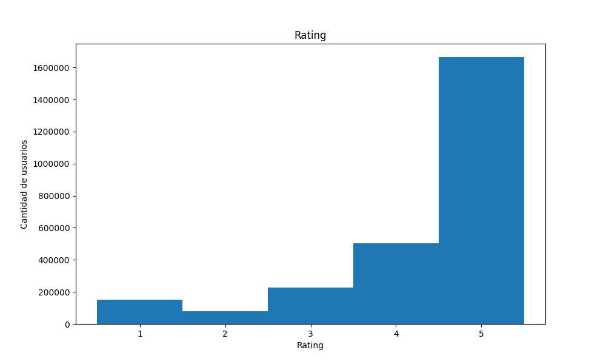

### Comentario
Cerca de la mitad de los reviews tiene algún tipo de comentario

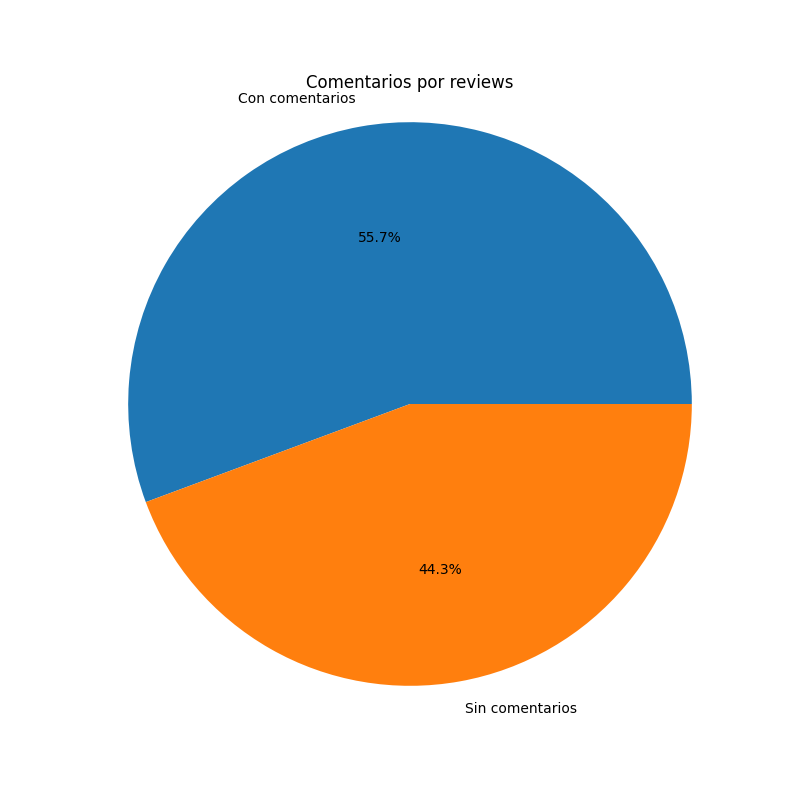

### Imagenes 
Un 96% de las reviews no tienen ninguna foto.
Los usuarios normalmente sacan más fotos de los lugares con mejores reviews.
Se concluye que las fotos son para mostrar aspectos positivos.

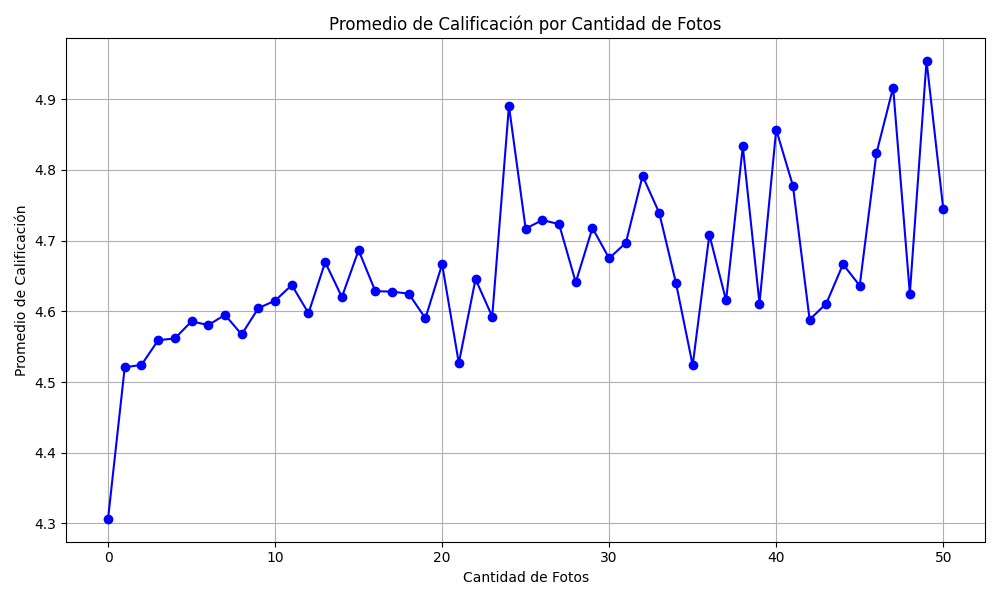

### Respuesta
Solo un 9% de las reviews tiene algún tipo de respuesta.

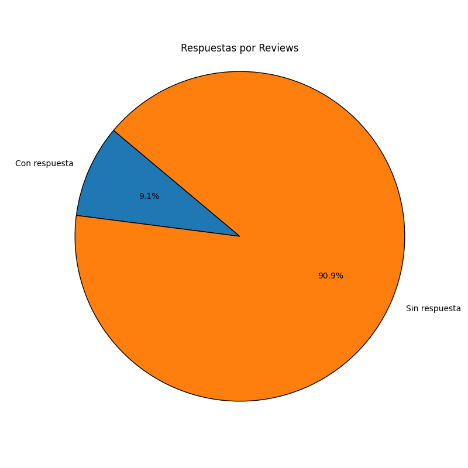

### Análisis por usuarios

#### reviews
Los distintos usuarios suelen hacer pocas reviews.

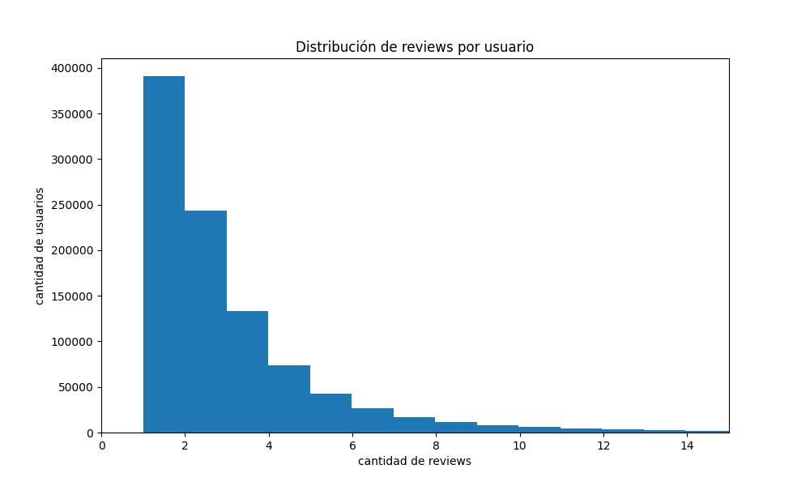

#### Rating vs cantidad de reviews
A partir de la tendencia observada, puede concluirse que a medida que un usuario realiza más reseñas, tiende a ser más exigente para su puntuación.

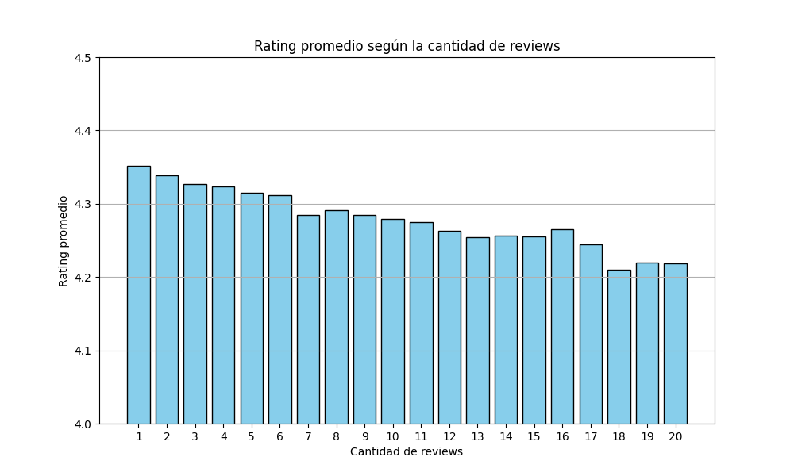

#### fotos
La mayoría de los usuarios sólo saca una o dos fotos.

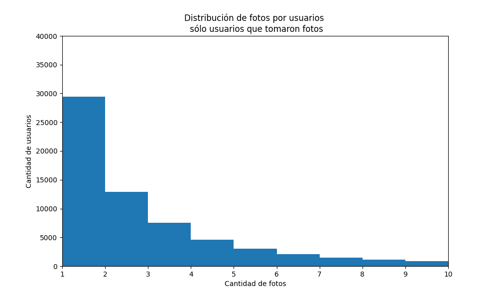

### Analisis temporal

La mayoría de las reviews se dan en horario diurno

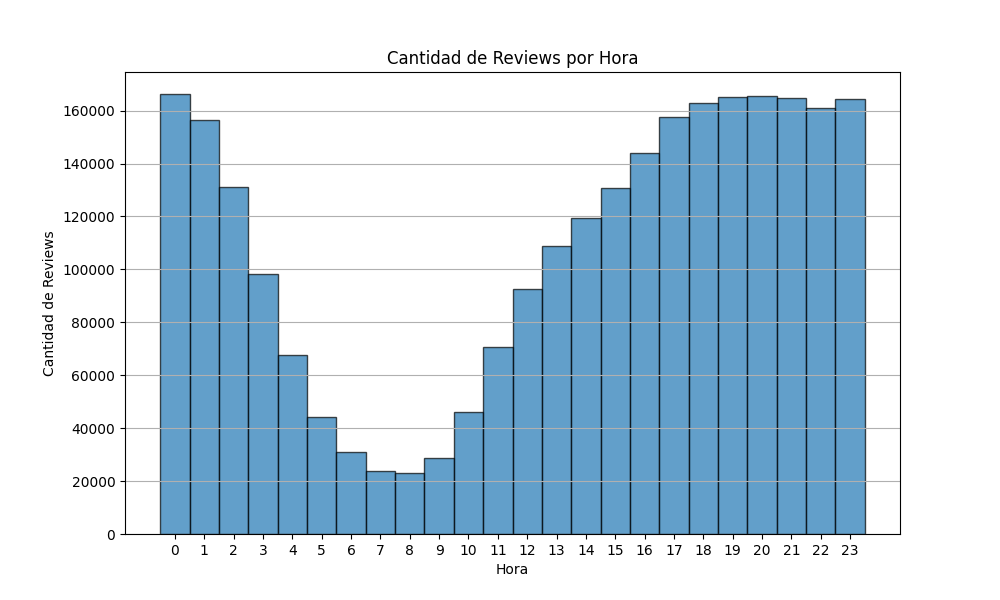

La mayoría de las reviews se dan en los meses de verano (Julio, Agosto). La diferencia igual no es significativa. Se observa una baja de las reviews en el período más afectado de la pandemia.

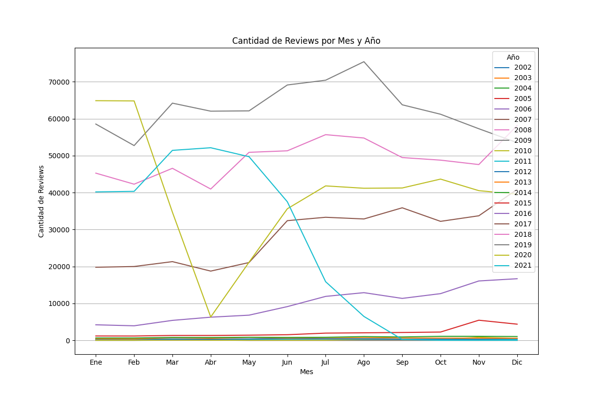

## metadata-sitios

Los lugares con más reviews suelen ser los que tienen mejor puntaje.

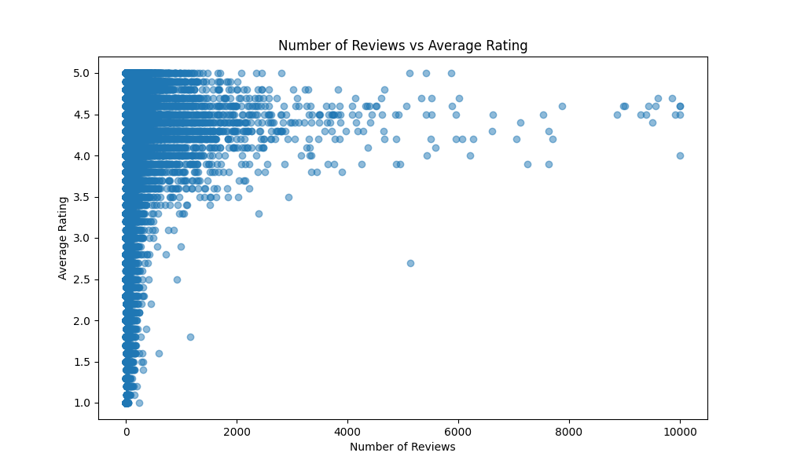

Estas son las categorías con mas establecimientos

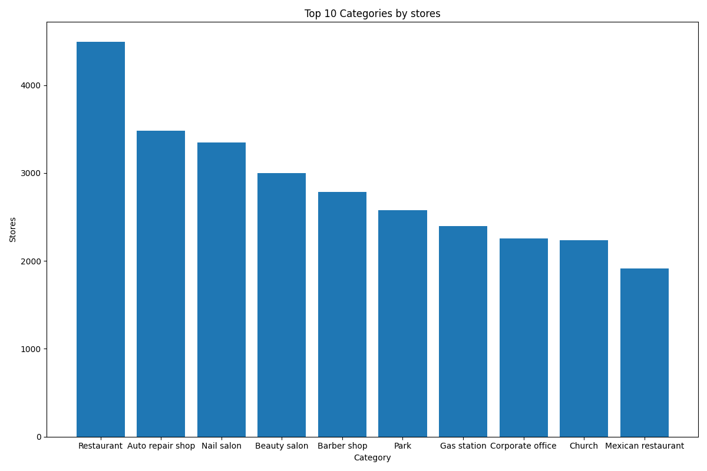

Categorías con más reviews

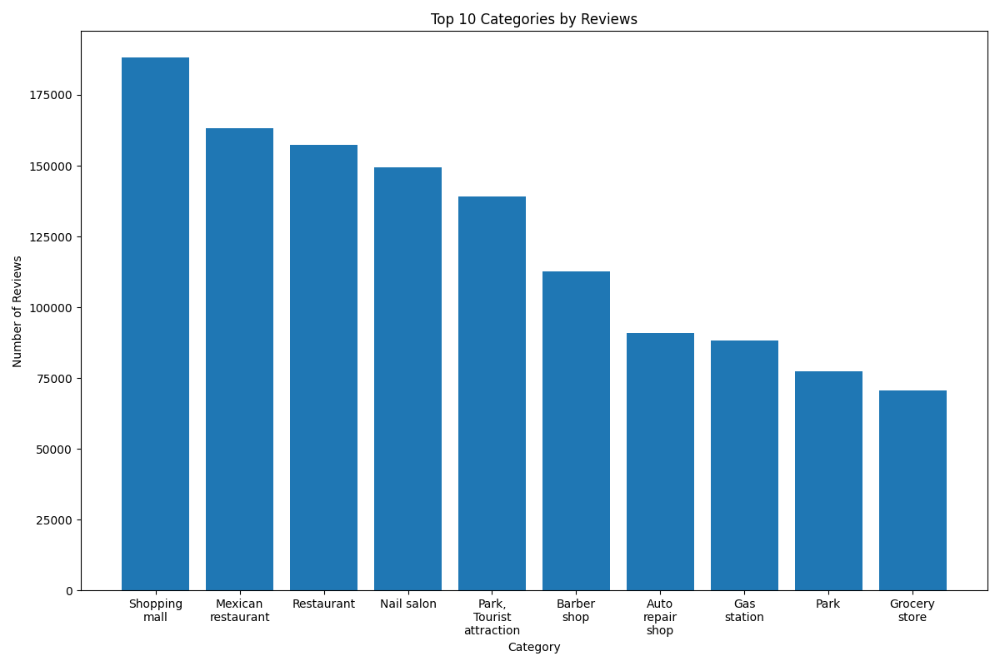

Categorías mejor puntuadas

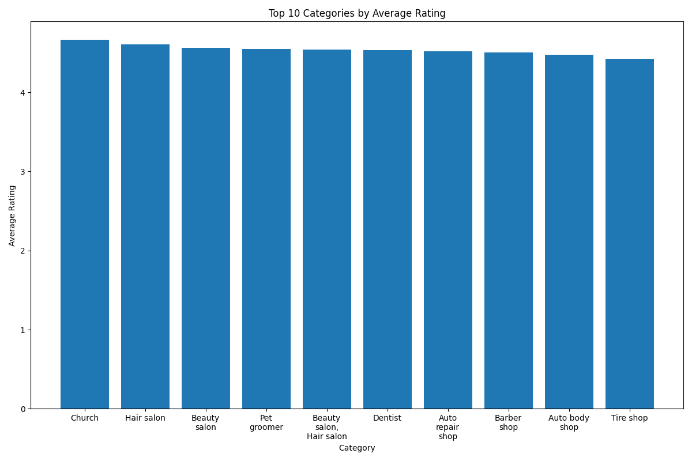

## Relación entre ambas bases de datos

No se observa un cambio significativo del tipo de negocio según el horario de la review

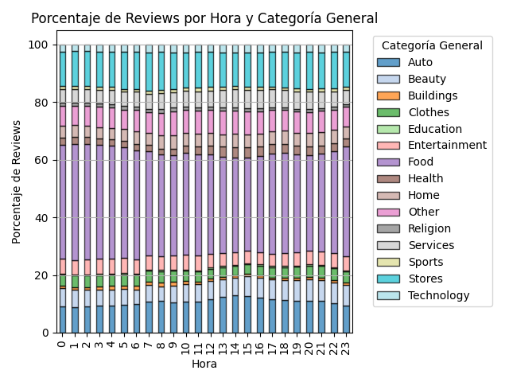