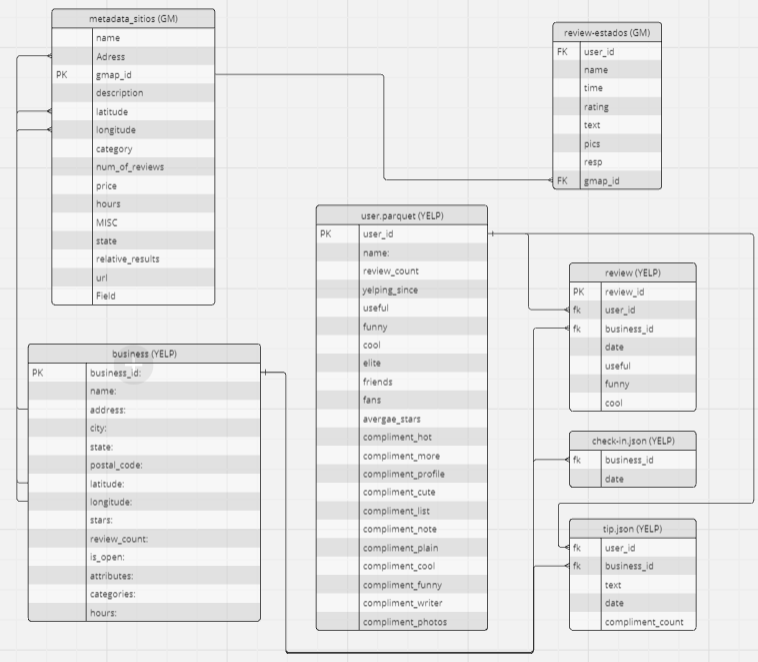
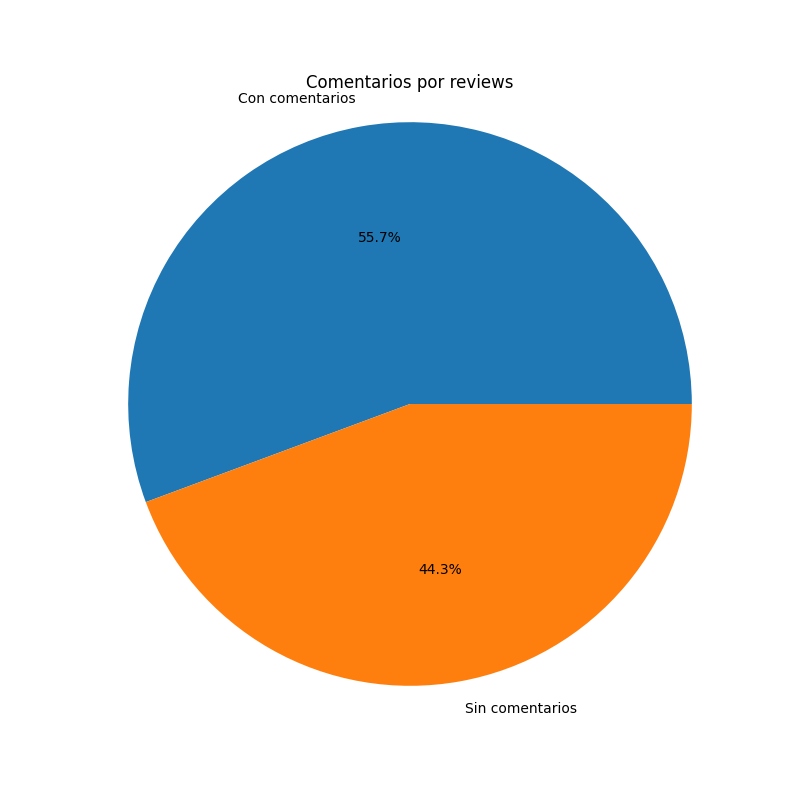
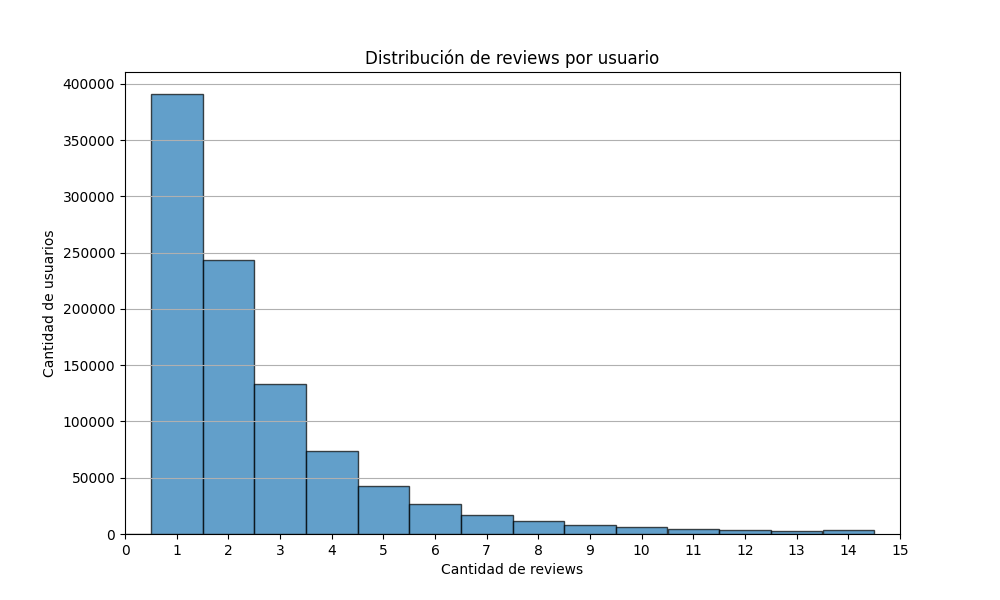
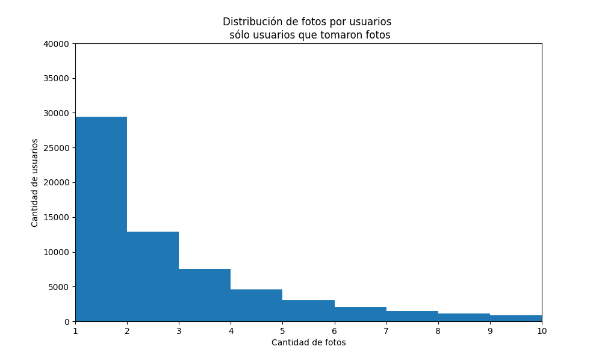

# Diagrama Entidad-relación

# Requerimientos de almacenamiento

## Reviews

Son 2.700.000 registros. Sin resgistros completamente nulos.
Existen 76.277 datos duplicados que deben eliminarse (usando las columnas 'user_id' y'time'). El analisis realizado tiene en cuenta su eliminación.
165 Mb

### user_id
Es un entero de 21 cifras. Los valores de enteros de pandas no soportan valores tan grandes, por eso los pasan a float64. Hay que pasar al int nativo de Python. Para Pandas va a ser un object entonces, pero para Python un entero. Sin nulos. 973.518 usuarios diferentes.
 **ver como se trata en el flujo de datos**

### name
Es un texto. El que más valor tiene, tiene 77 caracteres. Hay caracteres en todos los idiomas (chino, japonés, etc). Sin nulos.
40 Mb

### time
Valores de números enteros de 13 cifras. Son marcas de tiempo en milisegundos desde la época Unix (1970-01-01). Sin nulos.
40 Mb

### rating  
Enteros del 1 al 5. Sin nulos.
40.1 MB

### text 
Texto. 1.170.964 nulos (previo a eliminar los duplicados). 1.163.823 sin los duplicados
No existen nulos que estén compuestos sólo por un espacio.
El texto más largo tiene 8360 caracteres, incluyendo espacios (es la traducción de google, pone el idiona original e inglés).
Media de 132 caracteres, mediana de 70. 75% 154.
40 Mb

### pics 
lista con diccionario de la forma 'url' : y la url entre corchetes y comilla individual. Puede contener más de un diccionario.
'[{'url': ['https://lh5.googleusercontent.com/p/AF1QipOQvLGEgw3N8Q6ZuF-6-bTuJsJyc5w_hRqhcDmK=w150-h150-k-no-p']}]'
2.600.710 nulos (previo a eliminar los duplicados). 2.530.146 sin los duplicados
Caracteres totales incluyendo el key: mayor 5600 . Media de 337, mediana de 224, 75% 336  

### resp 
Diccionario de la forma {'time': , 'text': ''}
El tiempo como timestamp de unix
2.454.831 nulos (previo a eliminar los duplicados). 2.386.301 sin los duplicadose
Caracteres totales incluyendo el timestamp: mayor 4.041 . Media de 175, mediana de 136, 75%  223
40 Mb

### gmap_id
Sin nulos. Texto de entre 22 y 37 caractéres. Clave secundaria para la clave primaria de la tabla Metadata-sitios

## metadata-sitios
294.593 una vez eliminados los duplicados.

### name
Texto. Sin nulos. Maximo: 246 caracteres.
### address
Texto. Sin nulos. 'Porter Pharmacy, 129 N Second St, Cochran, GA 31014'. Largos entre 14 y 297 caracteres.
Puede tener más comas, pero siempre, de derecha a izquiera, CP y estado, localidad, dirección, nombre del local (que puede tener un listado de actividades también, separadas por comas)
### gmap_id 
Texto. Sin nulos. Dos códigos con 22 caracteres, uno con 33 y el resto entre 34 y 35 caracteres. 
### description
Texto. 265.391 nulos (incluyendo duplicados). 262.864 quitando los duplicados. Entre 24 y 110 caracteres.
Largo máximo 110 caracteres.
### latitude
Float64. Sin nulos. decimal de dos cifras enteras y 6 decimales.
### longitude
Float64. Sin nulos. decimal negativo de tres cifras enteras y 6 decimales.
### category 
1.906 nulos (incluyendo duplicados). 1.881 quitando los duplicados.
Figura como texto pero cada valor es una lista de categorías. Hay listas con una sola categoría y listas con hasta 14 categorías.
Máximo 312 caracteres con espacios incluídos.
Son 3.854 categorías. Top 3: Restaurant: 11.505, Auto repair shop: 8.729, Beauty salon: 7.846.
1.320 categorías con menos de 10 locales, 2.855 con menos de 100
### avg_rating
Decimales del 1 al 5, con una posicion decimal
Sin nulos. 
### num_of_reviews 
Enteros, entre 1 y 9.998
Sin nulos
### price 
265.713 nulos (incluyendo duplicados). 263.155 quitando los duplicados.
Texto, el simbolo de dinero, y más valores según si cobra más caro. Máximo 4 caracteres. 
Sólo 8 tipo de valores: '$', '$$', '$$$', '$$$$', '₩', '₩₩', '₩₩₩', '₩₩₩₩'
### hours
texto para pandas. en realidad es una lista, con listas adentro, con el par día de la semana , horarios.
son siempre de 7 días. máximo 225 caracteres con espacios
Ejempllo: [['Thursday', '6:30AM–6PM'],
 ['Friday', '6:30AM–6PM'],
 ['Saturday', '6:30AM–6PM'],
 ['Sunday', '7AM–12PM'],
 ['Monday', 'Closed'],
 ['Tuesday', '6:30AM–6PM'],
 ['Wednesday', '6:30AM–6PM']]
67.190 nulos (incluyendo duplicados). 66.506 quitando los duplicados.
### MISC
diccionario, que pandas toma como objeto (str)
máximo con 13 claves-valores, con valores como listas. Máximo de 1.279 caracteres contando los espacios
53.131 nulos (incluyendo duplicados). 52.500 quitando los duplicados.
### state
Texto. Indica si está abierto o cerrado en el momento en que se tomo el dato.
Yo lo descartaría. máximo de 41 caracteres
63.895 nulos (incluyendo duplicados). 63.238 quitando los duplicados.
### relative_results
Lista de negocios relacionados.
Figura como texto para pandas, pero tiene listas. El individual lo toma como listas
Máximo 205 caracteres con espacios, 5 objetos en la lista.
24.307 nulos (incluyendo duplicados). 23.740 quitando los duplicados.
### url
Str con la dirección de google maps. Entre 97 y 172 caracteres.
Sin nulos.

# Análisis Estadístico

## Reviews

### rating  

### text 

### pics 

### resp 

### análisis por usuarios

#### reviews

#### rating

#### fotos

## metadata-sitios
