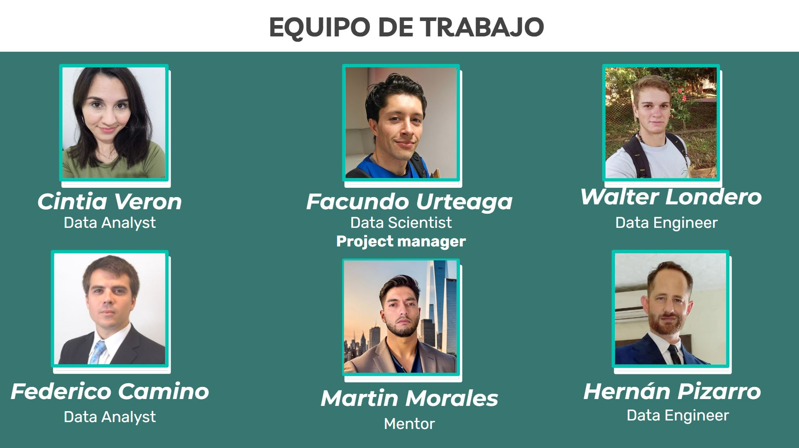
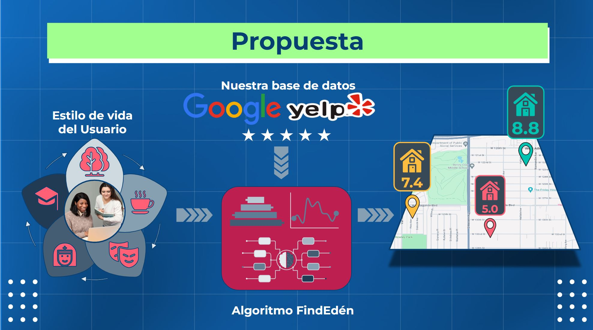
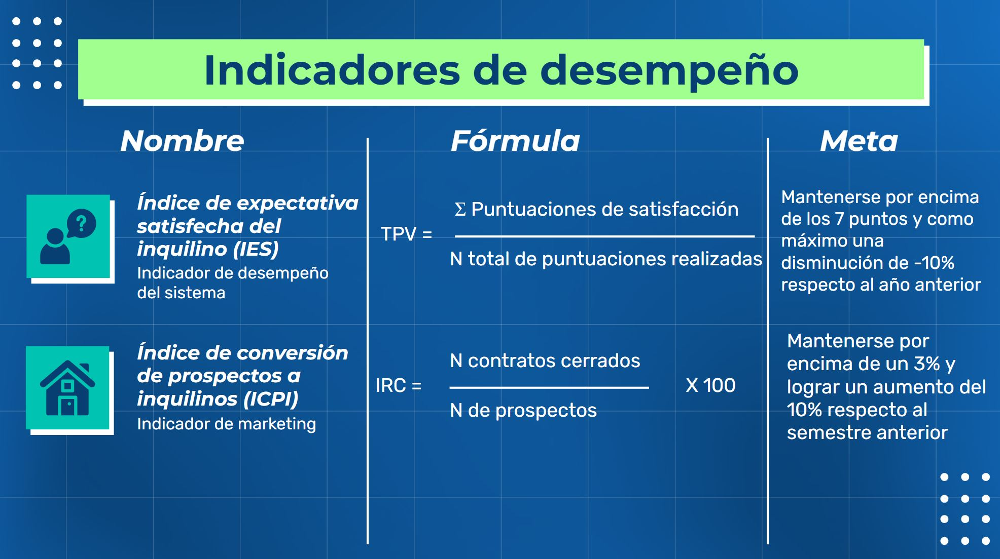
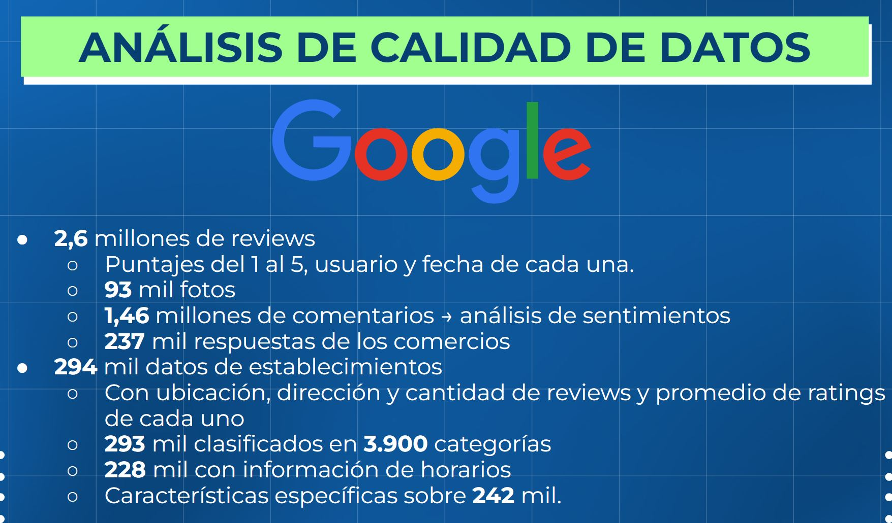
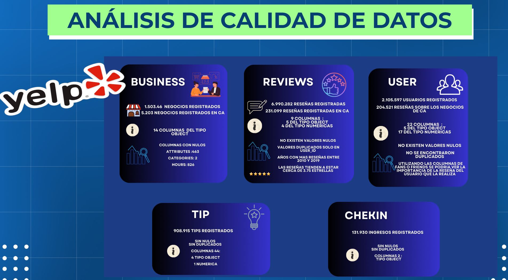
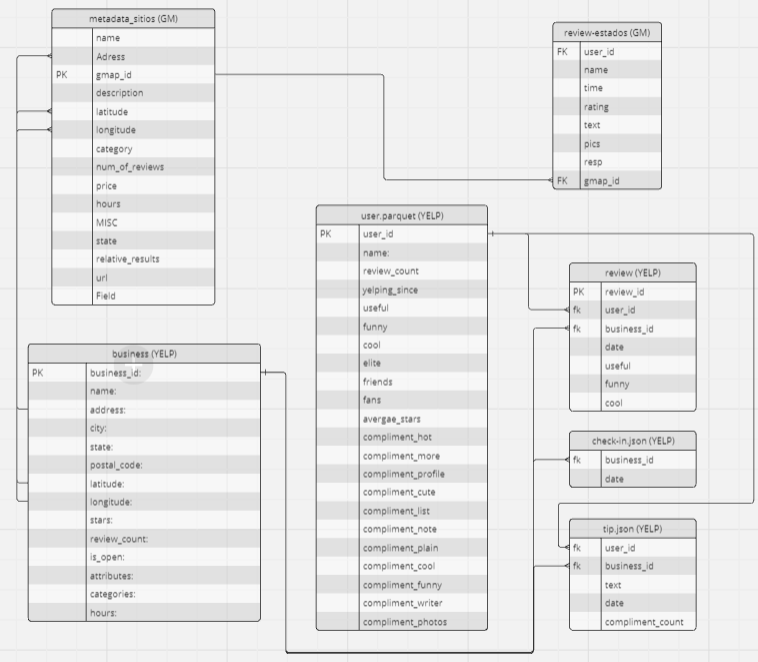
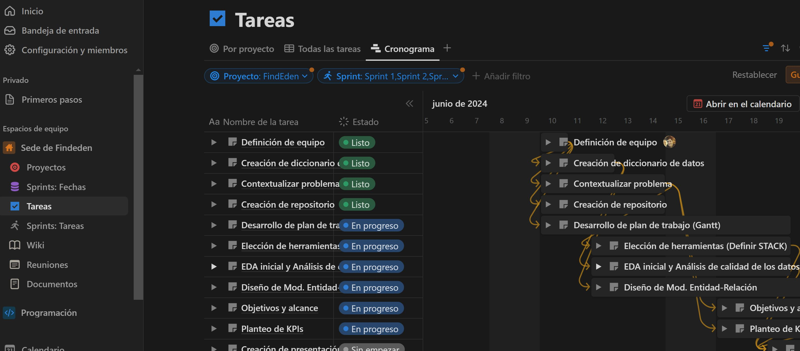
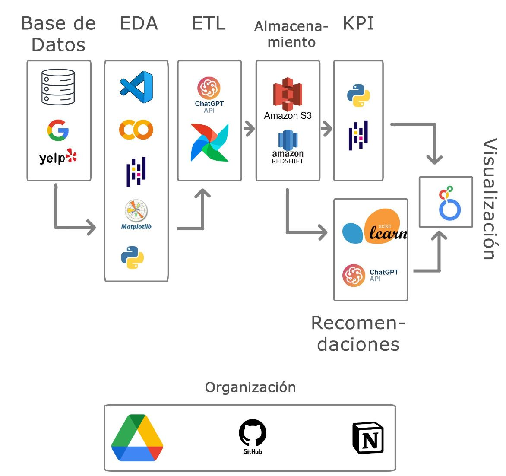

<h1 align="center"> PROYECTO FINAL HENRY: GOOGLE - YELP  </h1>
<h3 align="center"> Equipo de trabajo: Camino Federico, Londero Walter, Pizarro Hernan, Urteaga Facundo, Veron Cintia </h3>

   

   
   

  
  
  
  
   
  
  
  
  
  
  

# Índice

*[Descripción del proyecto solicitado](#descripción_del_proyecto_solicitado)

*[Introducción](#introducción)

*[Situación problemática](#situación_problemática)

*[Propuesta de trabajo](#propuesta_de_trabajo)

*[Características de los datos](#características_de_los_datos)

*[Plan de trabajo](#plan_de_trabajo)

# Descripción del proyecto solicitado

## Contexto

La opinión de los usuarios es un dato muy valioso, que crece día a día gracias a plataformas de reseñas. Su análisis puede ser determinante para la planificación de estratenias. Yelp es una plataforma de reseñas de todo tipo de negocios, restaurantes, hoteles, servicios entre otros. Los usuarios utilizan el servicio y luego suben su reseña según la experiencia que han recibido. Esta información es muy valiosa para las empresas, ya que les sirve para enterarse de la imagen que tienen los usuarios de los distintos locales de la empresa, siendo útil para medir el desempeño, utilidad del local, además de saber en qué aspectos hay que mejorar el servicio. Además, Google posee una plataforma de reseñas de todo tipo de negocios, restaurantes, hoteles, servicios, entre otros integrada en su servicio de localización y mapas, Google Maps. Los usuarios utilizan el servicio y luego suben su reseña según la experiencia vivida. Muchos usuarios leen las reseñas de los lugares a los que planean ir para tomar decisiones sobre dónde comprar, comer, dormir, reunirse, etc. Esta información es muy valiosa para las empresas, ya que les sirve para enterarse de la imagen que tienen los usuarios de los distintos locales de la empresa, siendo muy útil para medir el desempeño, utilidad del local, además de identificar los aspectos del servicio a mejorar.

## Trabajo a realizar

Recopilar, depurar y disponibilizar la información: Creación de una base de datos (DataWarehouse) de diferentes fuentes, tanto provistas por Henry como incorporadas por ustedes, corriendo en local o alojada en proveedores en la nube. La base de datos depurada deberá contemplar por lo menos dos tipos diferentes de extracción de datos, ejemplo: datos estáticos, llamadas a una API, scrapping, entre otros.
Reporte y análisis significativos de la(s) línea(s) de investigación escogidas: El análisis debe contemplar las relaciones entre variables y concluir, si es que existe, una relación entre estas, y los posibles factores que causan dicha relación en la realidad.
Entrenamiento y puesta en producción de un modelo de machine learning de clasificación no supervisado o supervisado: El modelo debe resolver un problema y conectar globalmente con los objetivos propuestos que se propongan como proyecto.

# Introducción

## Quiénes somos

   

   
   

   

EdenFornia Solutions es una empresa innovadora que ofrece soluciones informáticas y aplicaciones especializadas para el sector inmobiliario, aprovechando el poder de la ciencia de datos y sus tecnologías asociadas. Nos dedicamos a transformar la manera en que se gestionan y operan las propiedades mediante el análisis avanzado de datos, inteligencia artificial y aprendizaje automático. Nuestro enfoque holístico se centra en el bienestar de las personas, proporcionando herramientas que optimizan la toma de decisiones, mejoran la eficiencia operativa y aumentan la rentabilidad para nuestros clientes. En EdenFornia Solutions, combinamos nuestra experiencia en tecnología con un profundo conocimiento del mercado inmobiliario para ofrecer productos que no solo satisfacen las necesidades específicas de nuestros usuarios, sino que también promueven su bienestar y calidad de vida.

## Equipo de trabajo

   

   
   

   

Nuestro equipo de trabajo en EdenFornia Solutions está conformado por un grupo interdisciplinario con experiencia en programación, ingeniería de software y relaciones humanas. Contamos con desarrolladores expertos en algoritmos de machine learning, ingenieros especializados en sistemas escalables y profesionales en gestión de relaciones con el cliente, todos trabajando en conjunto para ofrecer soluciones innovadoras y centradas en el bienestar de nuestros usuarios.

# Situación problemática

## Generalidades

En el mercado inmobiliario actual, la búsqueda de inmuebles para compra o alquiler se basa predominantemente en criterios clásicos como el precio, la ubicación, el tamaño y las características físicas de la propiedad. Sin embargo, estos criterios no consideran de manera integral los aspectos fundamentales del bienestar humano que son cruciales para la calidad de vida de los individuos. Esta carencia en la evaluación de propiedades puede llevar a decisiones de vivienda que no satisfacen plenamente las necesidades personales de los residentes.
La filosofía del bienestar, promovida por enfoques como el Well-being Index de la OECD y el modelo de Wellness en salud pública, resalta la importancia de factores adicionales que influyen en el bienestar integral. Estos incluyen la proximidad a servicios de salud, oportunidades recreativas, acceso a educación, seguridad, transporte y calidad ambiental, entre otros. A menudo, estos factores son ignorados en las plataformas inmobiliarias tradicionales.

## Contexto: Estado de California

Un informe reciente del California Health Care Foundation (CHCF) subraya los desafíos que enfrentan los residentes del estado en relación con la vivienda y el bienestar. El estudio revela que, a pesar de tener acceso a viviendas asequibles, muchos californianos experimentan una baja calidad de vida debido a la falta de acceso a servicios esenciales como atención médica, opciones recreativas y transporte público eficiente. Estos factores han sido identificados como críticos para el bienestar general de los residentes.
Por ejemplo, en áreas urbanas como Los Ángeles y San Francisco, la proximidad a parques y centros recreativos está directamente relacionada con niveles más altos de satisfacción personal y salud física. Sin embargo, en muchas comunidades, estos recursos no están adecuadamente distribuidos, lo que crea disparidades significativas en el bienestar.

# Propuesta de trabajo

## Aplicación FindEdén®

   

   
   

   

   
Desde EdenFornia Solutions®, se propone abordar esta problemática con la creación de la aplicación FindEdén®, integrando en su plataforma una metodología centrada en el cliente, basada en las filosofías de bienestar mencionadas. Utilizando un enfoque holístico, FindEdén® ofrecerá recomendaciones de propiedades no solo basadas en los criterios clásicos, sino también en factores clave del bienestar humano, asegurando que los usuarios encuentren un hogar que realmente se adapte a su estilo de vida y promueva su bienestar integral. Esta aplicación se podrá anexar a las bases de datos y motores de búsqueda convencionales de los servicios inmobiliarios. El usuario ingresará a la aplicación, y a partir de una serie de preguntas relacionadas a sus preferencias y modos de vida, y en conjunto con nuestra base de datos de reseñas, puntuará del 1 al 10 los inmuebles que ofrece la empresa. Los valores mas altos indicarán un mayor grado de conexión entre el inmueble y las preferencias y modo de vida del usuario.

## Propuesta de valor

* **Plataforma Innovadora**: FindEden es una plataforma web que revolucionará la búsqueda de viviendas con recomendaciones basadas en el estilo de vida del cliente.

* **Tecnología Avanzada**: Utiliza técnicas de NLP y ML para integrar datos de reseñas y comportamientos de usuarios, proporcionando recomendaciones altamente personalizadas.

* **Experiencia del Usuario**: Garantiza una experiencia excepcional, ayudando a cada individuo a encontrar su propio Edén.

* **Impacto en el Mercado**: Potencia la toma de decisiones de los inquilinos, aumentando acuerdos firmados y mejorando la tasa de renovación de contratos en el sector inmobiliario.

   

   
   

## Medidas de desempeño

Nuestros cuatro KPIs abordan aspectos clave del servicio inmobiliario, ofreciendo una visión integral del rendimiento y la satisfacción del cliente. El KPI sobre el tiempo de vacancia de inmuebles permite evaluar la eficiencia operativa y la demanda del mercado, mientras que la tasa de renovación de contratos indica la fidelización de los inquilinos y la estabilidad de ingresos. El grado de satisfacción de los usuarios mide la calidad del servicio y la experiencia del cliente, y la relación de prospectos a inquilinos refleja la efectividad de nuestras estrategias de conversión. Esta variedad de KPIs abarca diferentes ámbitos del servicio inmobiliario, proporcionando una evaluación completa y equilibrada de nuestro desempeño y áreas de mejora.

   
   

   
   

# Características de los datos

Para garantizar la calidad y eficacia de la integración de los datos en un sistema de almacenamiento (ETL) para su posterior uso en la plataforma, es fundamental obtener una visión general de la estructura y el contenido de los datos. Esto incluye la creación de un diccionario de datos, la elaboración del Diagrama Entidad-Relación y la realización de análisis exploratorios de los datos (EDA). Debido a la variedad de instituciones, locales, servicios y lugares públicos que tienen reseñas, estos datos son una excelente fuente para nuestra aplicación, proporcionando información valiosa que puede ser aprovechada para mejorar nuestras recomendaciones y la experiencia del usuario.

   

   
   

   

   
   

## Diagrama Entidad-relación

El modelo de entidad relación muestra como por un lado se relacionan las tablas de google maps y las tablas de Yelp entre sí.
Para relacionar las tablas de un sistema y otro vamos a utilizar la ubicación de los locales.
Su dirección, y sus ubicaciones geolocalizadas, utilizando una exactitud de ésta última acorde a nuestra necesidad.

# Plan de trabajo

En nuestro plan de trabajo, nos centramos en tres aspectos clave. Primero, asignamos roles dentro del equipo para aprovechar las habilidades individuales y definir claramente las responsabilidades. Luego, a partir de la metodología Agile, se definieron las actividades a realizar en tres Sprints y creamos un cronograma detallado utilizando Notion, lo que nos permitió establecer plazos realistas y mantenernos alineados con los objetivos. Por último, definimos nuestro stack tecnológico con base en las necesidades específicas de la aplicación, asegurándonos de seleccionar las herramientas adecuadas para el desarrollo eficiente y el rendimiento óptimo. Estas estrategias fueron fundamentales para coordinar nuestros esfuerzos y avanzar de manera estructurada hacia nuestros objetivos.

## Cronograma

Mediante la metodología AGILE, se definió un plan de trabajo con tres Sprints con tareas y responsables definidos. Este sistema se implementó en Notion.

   

   
   

   

   <em>Figura: Entorno de NOTION </em>
   

   
## **Nuestro Stack Tecnológico**

Este proyecto se basa en un robusto conjunto de tecnologías que abarcan desde la extracción y transformación de datos hasta la visualización y análisis de resultados.

**Extracción y Transformación de Datos (ETL):**

* **Python:** El núcleo de nuestro proceso ETL, proporcionando flexibilidad y un amplio ecosistema de librerías especializadas.
* **Pandas:** La herramienta principal para manipular y analizar datos, facilitando la limpieza, transformación y agregación de información.
* **SQLAlchemy:** Permite una interacción fluida con nuestra base de datos MySQL, asegurando la persistencia y consulta eficiente de los datos.
* **Google Drive API:** Integración con Google Drive para acceder y descargar automáticamente los datos fuente.
* **NumPy:** Proporciona soporte para operaciones numéricas y arrays, optimizando el rendimiento de cálculos complejos.

**Almacenamiento y Versionado:**

* **MySQL:** Nuestra base de datos relacional local, donde almacenamos los datos estructurados de manera organizada y accesible.
* **Google Cloud BigQuery:** Almacén de datos en la nube altamente escalable y eficiente, utilizado para análisis y procesamiento de grandes volúmenes de datos.
* **GitHub:** Plataforma de control de versiones que nos permite colaborar en el código de manera eficiente, manteniendo un historial de cambios y facilitando la implementación de nuevas funcionalidades.

**Visualización y Análisis:**

* **Streamlit:** Framework de Python que nos permite crear aplicaciones web interactivas para visualizar y explorar los resultados del ETL, así como para implementar el sistema de recomendaciones.
* **Power BI:** Herramienta de inteligencia de negocios que utilizamos para crear dashboards y reportes personalizados, proporcionando una visión clara y accionable de los indicadores clave de rendimiento (KPIs) y otros aspectos relevantes del proyecto.
* **matplotlib:** Librería de visualización de datos en Python, utilizada en el proceso ETL para generar gráficos que nos ayudan a comprender mejor los datos.

**Organización y Colaboración:**

* **Notion:** Plataforma centralizada que utilizamos para documentar el proyecto, organizar tareas, gestionar el conocimiento y fomentar la comunicación efectiva entre los miembros del equipo.

**En resumen,** nuestro stack tecnológico combina herramientas de código abierto, soluciones empresariales y servicios en la nube para crear un flujo de trabajo completo y escalable, desde la obtención de datos hasta la generación de insights valiosos para la toma de decisiones.

   

   
   

   

     <em>Figura: Stack Tecnológico </em>
   

## Esquema General del ETL Local:

1. **Extracción (Extract):**

   - **Datos de locales:** Se obtienen datos de locales desde archivos JSON alojados en Google Drive. Estos archivos contienen información sobre direcciones, coordenadas geográficas, categorías, valoraciones promedio, número de reseñas, y horarios de atención.

   - **Reseñas de Google:** Se descargan reseñas de Google desde archivos JSON en Google Drive. Estos archivos incluyen datos sobre los usuarios, las fechas de las reseñas, las valoraciones y los identificadores de los locales (gmap\_id).

2. **Transformación (Transform):**

   - **Limpieza de datos:** Se eliminan duplicados, se corrigen formatos, y se extraen datos relevantes como ciudades a partir de direcciones.

   - **Categorización:** Se crean nuevas categorías generales para los locales (por ejemplo, "Comida", "Entretenimiento", "Salud") y subcategorías más específicas.

   - **Cálculo de métricas:** Se calculan métricas como horas de apertura diurnas y nocturnas, frecuencia de categorías, y valoraciones ponderadas de usuarios.

   - **Filtrado:** Se seleccionan los locales y reseñas relevantes para el análisis, descartando aquellos que no aportan información útil.

   - **Preparación para Machine Learning:** Se crean conjuntos de datos finales que incluyen información sobre locales, reseñas y usuarios, listos para ser utilizados en modelos de aprendizaje automático.

3. **Carga (Load):**

   - **Almacenamiento local:** Los datos procesados se guardan en archivos CSV localmente.

   - **Carga en MySQL:** Se utiliza un script para cargar los datos de forma incremental en una base de datos MySQL, creando tablas si es necesario y evitando la duplicación de datos.

   - **Carga en Google BigQuery:** Opcionalmente, los datos también pueden cargarse en Google BigQuery, un servicio de almacenamiento de datos en la nube de Google Cloud Platform.

## WorkFlow 
   El ETL sigue un flujo de trabajo claro, utilizando diversas tecnologías para lograr su objetivo:

1. **Extracción:**
   - **Google Drive:** Se emplea la librería `gdown` para descargar los archivos JSON que contienen los datos de locales y reseñas desde Google Drive.
   - **Pandas:** Los datos JSON se cargan en DataFrames de Pandas para su posterior manipulación y análisis.

2. **Transformación:**
   - **Pandas:** Se realizan diversas operaciones de limpieza, filtrado, transformación y agregación de datos utilizando las funciones y métodos de Pandas.
   - **Expresiones Regulares (Regex):** Se utilizan expresiones regulares para extraer información específica de las cadenas de texto, como ciudades a partir de direcciones.
   - **NumPy:** Se emplea NumPy para realizar cálculos numéricos y manipular arreglos de datos.
   - **Matplotlib:** Se utiliza para generar un histograma que visualiza la distribución de la cantidad de reseñas por usuario.

3. **Carga:**
   - **CSV:** Los datos transformados se guardan en archivos CSV localmente para su posterior uso.
   - **MySQL:** Se utiliza la librería `sqlalchemy` para establecer una conexión con una base de datos MySQL y cargar los datos de forma incremental.
   - **Google Cloud Platform (GCP) BigQuery:** Opcionalmente, se puede utilizar un script adicional (`cloud_up.py`) para cargar los datos a BigQuery, un servicio de almacenamiento de datos en la nube de GCP.

**Tecnologías Clave:**

* **Python:** Lenguaje de programación principal utilizado para todo el proceso ETL.
* **Pandas:** Librería fundamental para la manipulación y análisis de datos.
* **gdown:** Librería para descargar archivos desde Google Drive.
* **sqlalchemy:** Librería para interactuar con bases de datos SQL.
* **MySQL:** Sistema de gestión de bases de datos relacionales.
* **Google Cloud Platform (GCP) BigQuery:** Servicio de almacenamiento de datos en la nube (opcional).
* **Expresiones Regulares (Regex):** Para la extracción de patrones en texto.
* **NumPy:** Para el cálculo numérico y manejo de arreglos.
* **Matplotlib:** Para la visualización de datos.

Este flujo de trabajo permite obtener datos de Google Drive, transformarlos para su análisis y cargarlos en diferentes destinos, tanto locales como en la nube, para su posterior uso en modelos de machine learning.

## Dashboard 

En el competitivo mundo de la gestión inmobiliaria, la capacidad para tomar decisiones basadas en datos precisos y actualizados es esencial. Con el objetivo de optimizar la gestión de propiedades y mejorar la rentabilidad, FindEdén® ha desarrollado un avanzado dashboard interactivo que proporciona una visión integral y detallada del rendimiento de su portafolio inmobiliario.

Este dashboard está diseñado para ofrecer una visualización clara y concisa de los KPIs más relevantes, como las tasas de ocupación, los tiempos de vacancia, y la satisfacción de los inquilinos. Mediante una interfaz intuitiva, los usuarios pueden monitorear en tiempo real el estado de sus propiedades, identificar tendencias emergentes, y tomar decisiones informadas con rapidez.

FindEdén® transforma datos complejos en insights valiosos, permitiendo una gestión eficiente y estratégica de propiedades. Con este dashboard, las inmobiliarias pueden mejorar sus estrategias de marketing, optimizar la ocupación y renovación de contratos, y comunicar resultados con claridad a stakeholders e inversionistas.

   

   
   

   

     <em>Figura: Dashboard </em>
   

